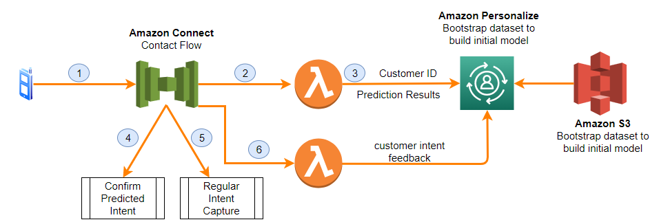
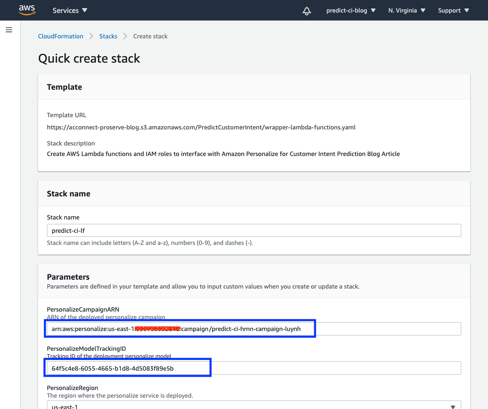
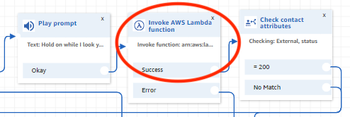
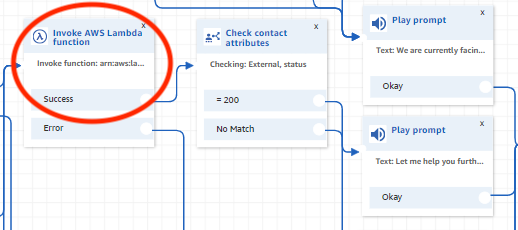

# What does this demo showcase?
Customers engage with businesses using a multitude of contact channels like voice, messaging, web, and social media. Each interaction includes customer identification, verification, and understanding the intent. This is followed by servicing the contact intent using either automated or live assistance. The primary customer need is expedited assistance to resolve the reason for the contact. It is therefore important to quickly understand the contact intent.

This demo shows a scenario where a customer calls into a contact center and the center IVR menu predicts his/her intention to call the service. 

This way, the customer experience is improved and time is saved. 

# How is this implemented?
This is implemented using

1. Amazon Connect is used for the IVR portion of the demo. A customer calls in to a toll free/DID number, which invokes an Amazon connect contact flow.
2. AWS lambda is used for integrating the IVR with the Amazon Personalize service. The customer ID is passed on to the Personalize service. 
3. Amazon Personalize is used for the intent prediction. 
4. If the intent is predicted with a high confidence score, the Lambda function returns a predicted intent to Amazon Connect. The score threshold value is configurable. The contact flow in Amazon Connect prompts the caller to confirm the predicted intent.
5. Otherwise, the Lambda function returns a value indicating that the model could not predict an intent for this interaction. The contact flow in Amazon Connect proceeds with the intent capture experience using either Amazon Lex (NLU), or a menu.
6. Before the end of the call, the actual confirmed intent of the customer is fed back into the Amazon Personalize API. This is used for making future predictions for this caller. 

# How to launch & run this demo?

## Step 1: Create Personalize resources using this predefined SageMaker notebook
1. Click on the link below to launch a CloudFormation stack.  This CF template launches the necessary IAM roles and SageMaker notebooks.

 
2. Once the CloudFormation stack is launched in CREATE_COMPLETE state, you can then navigate to the SageMaker notebook instance launched by this service.  Please run all cells in the train_personalize_with_customer_and_contact_records.ipynb notebook.  This takes about ~70 mins. Please do not close the notebook window or put the computer to sleep during this time.
 
3. After the cells have finished running, copy the values of campaign_arn and tracking_id variable outputs at the bottom of the notebook. 
personalize tracking id and campaign id

## Step 2: Launch Lambda Functions to invoke the Personalize service
1. Click on the link below to launch a CloudFormation stack.  This CF template launches the necessary lambda functions.

[](https://console.aws.amazon.com/cloudformation/home?region=us-east-1#/stacks/create/review?templateURL=https://aconnect-proserve-blogs.s3.amazonaws.com/PredictCustomerIntent/wrapper-lambda-functions.yaml&stackName=predict-ci-lf&param_ResourceBucket=aconnect-proserve-blogs&param_ResourceBucketKeyForUpdateEventLambdaFunction=PredictCustomerIntent/lambda/ccblog-update-real-time-customer-interactions-38d9b958-b7c9-4064-af7f-ddb06ced614b.zip&param_ResourceBucketKeyForGetRecommentationLambdaFunction=PredictCustomerIntent/lambda/ccblog-get-personalized-intent-d041341f-50b2-4017-8dee-3a885af2b0b9.zip&param_PersonalizeRegion=us-east-1&param_PredictionConfidenceScoreHighThreshold=0.8&param_PredictionConfidenceScoreLowThreshold=0.6&param_PersonalizeCampaignARN=Fill_this_in&param_PersonalizeModelTrackingID=Fill_this_in)
 
2. In the create stack screen please fill-in the PersonalizeCampaignARN and PersonalizeModelTrackingID copied from the notebook console earlier.

 
3. Complete launching the stack. 

## Step 3: Integrate the Amazon Connect instance with the prediction service
Provision your Amazon Connect instance.  Make sure that the Amazon Connect instance has permissions to access this newly created AWS Lambda
function by following these steps.

1. From the AWS Management Console, open the Amazon Connect console.
2. Select your Amazon Connect virtual contact center instance.
3. Choose Contact flows and scroll down to the AWS Lambda section.
4. On the Function drop-down menu, select predict-ci-lf-get-personalized-intent function and choose +Add Lambda Function.
5. Again, on the Function drop-down menu, select predict-ci-lf-update-real-time-customer-intent function and choose +Add Lambda Function.
Integrate Amazon Connect with Lambda function

## Step 4: Import the Call Flow into Amazon Connect

1. Download the pre-built contact flow from [this link](https://aconnect-proserve-blogs.s3.amazonaws.com/PredictCustomerIntent/PredictCustomerIntentFlow)
2. From the AWS Management Console, open the Amazon Connect console.
3. Select your Amazon Connect virtual contact center instance and log in.
4. On the navigation bar of the Amazon Connect console, choose Routing, Contact flows
5. Choose Create contact flow button at the top-right.
6. On the drop-down at the top-right, select Import flow.
7. Choose Select and select the PredictCustomerIntentFlow file downloaded in bullet 1.
8. On the contact flow, find the Invoke AWS Lambda function block. Open the settings for the block by selecting the header.
9. Select the Lambda function predict-ci-lf-get-personalized-intent that you granted Amazon Connect permissions in "Step 3: Integrate the Amazon Connect instance with the prediction service" above.  

 
10. Save. 
11. Choose the header for the Invoke AWS Lambda function block (second row) and select the Lambda function predict-ci-lf-update-real-time-customer-intent.

 
12. Save and publish.

## Step 5: Clean-up
1. Open the clean_up_personalize_resources.ipynb notebook provided in the SageMaker notebook and run all cells
2. Then delete the two CloudFormation stacks created in Step 1 and Step 2

# Running the demo
1. In your Amazon Connect instance, choose the Routing icon from the navigation bar, and choose Phone numbers.
2. Choose the phone number you want to associate with your new contact flow to edit.
3. Choose the name of your contact flow from the Contact flow/ IVR drop-down menu, and choose Save.
4. To make a test call, call the phone number you associated to the flow.

**High-Confidence prediction test call:** Use a customer identifier with a recent contact history record in the dataset results in a prediction with high confidence score. Enter the 5-digit customer identifier 35739 to be presented with an intent prediction, based on a prior transaction for this user identifier in the dataset.

**Low-Confidence prediction test call:** A customer identifier that is new to the dataset, or with no recent contact history results in a prediction with a low confidence score. Enter the 5-digit customer identifier 89789 to be presented with the IVR main menu. The prediction score is not sufficient to present a personalized prediction. The sample main menu provides two options (home loans, and credit cards) to bootstrap new customer interactions.

In both scenarios, the IVR confirms and captures the actual intent of the customer. It uses this data to make predictions for subsequent calls. If you call again with the same customer identifier, you may be presented with a different intent prediction result dynamically. Amazon Personalize updates the dataset in real time, and is able to adjust the recommendations accordingly.
